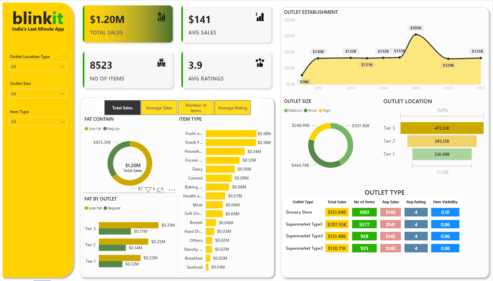

# Blinkit-Sales-Dashboard
Blinkit-Sales-Dashboard is a Power BI report that visualizes Blinkit’s sales data, showing key metrics like total revenue, top products, category-wise sales, and order trends. It helps monitor performance and supports data-driven decisions.

## 🚀 Features
- Total Sales Overview
- Top-Selling Products
- Sales by Category/Location
- Daily/Monthly Trends
- Customer Insights

## 📷 Preview

## 📁 Project Files
- `Blinkit-Sales-Dashboard.pbix`: Power BI file with visuals and measures.
- `data/`: Contains sample or dummy data used for the report (optional).
- `images/`: Screenshots or visual assets of the report.

## 🛠 Tools Used
- Power BI Desktop
- DAX (Data Analysis Expressions)
- Data modeling and transformation using Power Query

## 📌 How to Use
1. Download the `.pbix` file.
2. Open with Power BI Desktop.
3. Refresh data if connected to external sources or replace with your own data.

## 📬 Contact
For questions or feedback, feel free to reach out!

---
